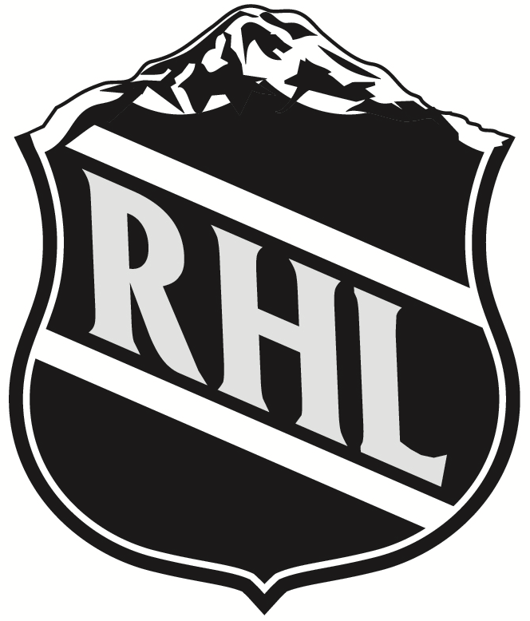

  

Rigged Hockey League
 

 

*The thing about rigging is, you can learn it if you become a master rigger but there's no book on rigging.*     

 Richard Serra 

 
*We will never be able to fix a rigged system if we count on those who rigged it in the first place.*     

 Donald Trump 

## What is the RHL?
In a world where a good rig goes unappreciated, the Rigged Hockey League, henceforth RHL, was developed to let rigging shine. The only honourable thing is to quietly do something sketchy and hope no one notices.

 
 

## Important dates    

- **Saturday, September 30:** Keeper deadline date   
- **TBA:** Draft
- **Oct 10:** First day of season
 
 

## Beginning of season FAQ

- You can only select keepers on the website version, not in the app version. When you log into yahoo and click on your team, there will be a link at the top asking you to select your keepers
- When selecting your keepers, also select your farm team as keeper players
- Any player who is 23 or younger on October 1st (i.e., born after Sept 30, 2000) must be brought up to your team for the beginning of the season, they cost 0 player years this year
- Trades can still be completed before you submit your keepers
- You can tell how many round of draft picks you'll have by subtracting the number of players you have kept (including farm team) from 19. For example, I have kept 12 players so I will draft up to an including round 7 (19-12). This doesn't take into account any previous trades of draft picks
- Draft Order:
  1. Suzuki Jimney
  2. Silken Cape
  3. Fracas
  4. Jeffa Petersburg
  5. Стивен Прекрасный
  6. Lance D'Rundell
  7. Deluge of Gardseur
  8. Connor Dioxide Emissions
- Draft pick trades:
  - Connor 3rd to Silken
  - Silken 7th to Connor
  - Connor 7th to Стивен
  - Стивен 6th to Connor

## Rules

### Team Composition

Weekly active roster of:    

- 6 forwards     
- 3 defensemen     
- 1 goalie     

Non-active:      

- 4 bench players     
- 5 Farm Team players (Farm Team description below)

### Scoring

Goals = 1 point       
Assists = 1 point       
Wins = 2 points     
Shutouts = 2 points

### Roster Change Timelines

Weekly head-to-head matchups run Monday to Sunday
Inter-roster moves can be made until puck-drop in first Monday game
Add/drops and trades must be executed on Sunday to have effect for next week

### Cost & Prizes

Cost is $20 per year
Pooled money will be used to purchase a cryptocurrency at the start of season
First place wins 88% of season-end pot. Second place wins 12%.

### Farm Team

Consists of 5 players (F, D or G)
Farm Team players do NOT count towards a team’s Keeper Years Limit
Eligible Players must be 23 years old or younger as of October 1 every season
Updated Farm Team lists must be submitted immediately after the draft
     - If you do not have 5 eligible Farm Team players immediately after the draft, you must drop a player and pick up a player through Waivers/Free Agency to submit a legal roster
Farm players are NOT eligible to play in your Active Roster
Players eligible for the Farm Team obtained by trade during the season CAN be assigned to a team’s Farm Team, even if they have been part of another team’s Active Roster.
An Updated list of Farm Teams maintained in the Google Document tabs

### Draft

Active Rosters and Farm Teams are filled in the same Draft
Every draft will consist of 19 rounds (to fill 14 Active Roster and 5 Farm Team spots)
A kept player will take the place of a Draft Pick at the end of the Draft
     - For example, a team retaining 8 Active Roster players and 5 Farm team players (13 total) will have 6 picks in the Draft. These will represent picks 1 through 6 in the Draft. Picks 7 through 19 will be allocated to the returning players.
Traded Draft Picks in the Kept Players range will be re-distributed according to each team’s situation.
     - In the above example, if the team had traded it’s 14th pick in a deal for a 2nd round pick, the team would have it’s 6 selections in the first 5 rounds (1, 2, 2, 3, 4, 5). The 6th round pick would go to the other team instead of the 14th.

Draft order:

1. Winner of Sucker’s Delight (non-playoff team matchup)     
2. Loser of Sucker’s Delight (non-playoff team matchup)     
3. 5th Place Matchup Winner     
5. 3rd Place Matchup Winner           
6. 3rd Place Matchup Loser            
7. Rigged Cup runner-up           
8. Rigged Cup winner

Updated Farm Team lists must be submitted immediately after the draft.
     - If you do not have 5 eligible Farm Team players immediately after the draft, you must drop a player and pick up a player through Waivers/Free Agency to submit a legal roster.
New players to the Yahoo Players List can only be acquired via the draft. College players and others signing contracts at the end of the season are not eligible to be picked up via Waivers/Free Agency.

### Keeping Players

Number of available Keeper Years are:
     - 10 in the first season
     - 12 in the second season
     - 14 in the third season and beyond.
Every consecutive year a player is kept increases his Keeper Year cost.
     - For example, if you've had a player for 2 years and want to keep him for a third, he will cost 2 Keeper Years. A player you drafted that season or picked up via Free Agency would cost 1 Keeper Year to keep.
Farm Team players do NOT count towards the Keeper Year Limit  when kept
You do not have to keep all your Farm Team players

### Playoffs

The top 6 regular season teams make the playoffs
Playoffs take place over 3 weeks, ending the week before the end of the NHL’s regular season
Top 2 regular season teams get a Round 1 bye
Semi-final (Round 2) matchups are re-seeded
Rigged Cup (Championships) and Sucker’s Delight (2 non-playoff teams) take place during the same week

### Trades

Trades DO NOT reset Keeper Years
Trade deadline will be the last Wednesday of the league’s regular season
Off-season trades are allowed - trading will re-open after Rigged Cup has been awarded
There will be another trading hiatus between submission of Keeper Lists and the Draft
Equal number of picks from each team have to be included in a trade

### Injured Reserve

There are 4 IR+ spots you can use
You CANNOT put Farm Team players in IR spots
Injured players CANNOT be picked up directly to an IR+ spot

### Penalties

Failure to follow any of the rules above (setting incorrect keepers, failure to submit farm team, etc.) will result in losing a draft pick.
For a first infraction you lose a 4th round pick. For each additional infraction that pick moves up a round. So after 4 infractions you'd lose your first round pick.
Because Yahoo doesn't allow us to just take a draft pick away, your draft pick will be replaced with the WORST PLAYER IN THE LEAGUE. (Of course, you can just drop him after. But still, you lost your draft pick.)

## Keeper Lists {.tabset}
### Connor Dioxide Emissions

|Main/farm |Player            | Keeper cost|
|:---------|:-----------------|-----------:|
|Main      |Jack Hughes       |           2|
|Main      |Connor McDavid    |           4|
|Main      |Evgeni Malkin     |           1|
|Main      |Anze Kopitar      |           1|
|Main      |Aleksander Barkov |           4|
|Main      |Steven Stamkos    |           4|
|Main      |Erik Karlsson     |           1|
|Main      |Noah Dobson       |           1|
|Main      |Devon Toews       |           1|
|Main      |Brad Marchand     |           1|
|Main      |Dylan Larkin      |           1|
|Main      |Seth Jones        |           1|
|Main      |Filip Forsberg    |           3|
|Main      |Max Pacioretty    |           1|
|Main      |Gabriel Landeskog |           1|
|Main      |Igor Shesterkin   |           4|
|Main      |Ilya Sorokin      |           1|
|Farm      |Shane Wright      |           0|
|Farm      |Kirby Dach        |           0|
|Farm      |Alexander Romanov |           0|
|Farm      |Lucas Raymond     |           0|
|Farm      |Philip Tomasino   |           0|

### Deluge of Gardseur

|Main/farm |Player             | Keeper cost|
|:---------|:------------------|-----------:|
|Main      |Nikita Kucherov    |           3|
|Main      |Sidney Crosby      |           4|
|Main      |Mika Zibanejad     |           1|
|Main      |Timo Meier         |           1|
|Main      |Claude Giroux      |           1|
|Main      |Kyle Connor        |           4|
|Main      |Adam Fox           |           1|
|Main      |Vince Dunn         |           1|
|Main      |Alex Pietrangelo   |           1|
|Main      |Roope Hintz        |           1|
|Main      |Patrice Bergeron   |           1|
|Main      |Vincent Trocheck   |           1|
|Main      |Jakob Chychrun     |           1|
|Main      |Patrik Laine       |           1|
|Main      |Andrei Vasilevskiy |           4|
|Main      |Alexandar Georgiev |           1|
|Farm      |Cole Perfetti      |           0|
|Farm      |Seth Jarvis        |           0|
|Farm      |Quinton Byfield    |           0|
|Farm      |Juraj Slafkovsky   |           0|
|Farm      |Rasmus Dahlin      |           0|

### Honey Badger DntCare

|Main/farm |Player            | Keeper cost|
|:---------|:-----------------|-----------:|
|Main      |Mikko Rantanen    |           4|
|Main      |Tyler Toffoli     |           1|
|Main      |Jordan Kyrou      |           2|
|Main      |Mats Zuccarello   |           2|
|Main      |Alex DeBrincat    |           4|
|Main      |Evander Kane      |           1|
|Main      |Dougie Hamilton   |           1|
|Main      |Brent Burns       |           1|
|Main      |Cale Makar        |           1|
|Main      |Matt Duchene      |           1|
|Main      |Johnny Gaudreau   |           2|
|Main      |Bo Horvat         |           1|
|Main      |Andrei Svechnikov |           3|
|Main      |Joonas Korpisalo  |           1|
|Main      |Phoenix Copley    |           1|
|Farm      |Alexis Lafreniere |           0|
|Farm      |Kent Johnson      |           0|
|Farm      |Matty Beniers     |           0|
|Farm      |Trevor Zegras     |           0|
|Farm      |Spencer Knight    |           0|

### Little Jarry

|Main/farm |Player            | Keeper cost|
|:---------|:-----------------|-----------:|
|Main      |J.T. Miller       |           2|
|Main      |Zach Hyman        |           1|
|Main      |Clayton Keller    |           1|
|Main      |Max Domi          |           1|
|Main      |Alex Tuch         |           1|
|Main      |Barrett Hayton    |           1|
|Main      |Drew Doughty      |           1|
|Main      |Mikhail Sergachev |           1|
|Main      |Michael Matheson  |           1|
|Main      |Hampus Lindholm   |           1|
|Main      |Dillon Dube       |           1|
|Main      |Stuart Skinner    |           1|
|Main      |Filip Gustavsson  |           1|
|Main      |Marc-Andre Fleury |           1|
|Farm      |Dylan Cozens      |           0|
|Farm      |Juuso Parssinen   |           0|
|Farm      |Marco Rossi       |           0|
|Farm      |Jack Quinn        |           0|
|Farm      |Vasily Podkolzin  |           0|

### Necas Fracas

|Main/farm |Player              | Keeper cost|
|:---------|:-------------------|-----------:|
|Main      |Mitch Marner        |           4|
|Main      |Tage Thompson       |           1|
|Main      |Matthew Tkachuk     |           2|
|Main      |William Nylander    |           3|
|Main      |Auston Matthews     |           4|
|Main      |Nikolaj Ehlers      |           3|
|Main      |Charlie McAvoy      |           1|
|Main      |Moritz Seider       |           1|
|Main      |Jake Guentzel       |           1|
|Main      |Kevin Fiala         |           1|
|Main      |Shayne Gostisbehere |           1|
|Main      |Connor Hellebuyck   |           1|
|Main      |Juuse Saros         |           2|
|Farm      |Tim Stutzle         |           0|
|Farm      |Robert Thomas       |           0|
|Farm      |Nico Hischier       |           0|
|Farm      |Martin Necas        |           0|
|Farm      |Matt Boldy          |           0|

### Suzuki Jimney

|Main/farm |Player            | Keeper cost|
|:---------|:-----------------|-----------:|
|Main      |Leon Draisaitl    |           4|
|Main      |Elias Pettersson  |           1|
|Main      |Valeri Nichushkin |           1|
|Main      |Alex Ovechkin     |           2|
|Main      |Sebastian Aho     |           4|
|Main      |Jack Eichel       |           4|
|Main      |Kris Letang       |           1|
|Main      |Brandon Montour   |           1|
|Main      |Thomas Chabot     |           1|
|Main      |Elias Lindholm    |           3|
|Main      |Patrick Kane      |           1|
|Main      |John Tavares      |           1|
|Main      |Filip Hronek      |           1|
|Main      |Frederik Andersen |           2|
|Main      |Vitek Vanacek     |           1|
|Farm      |Owen Power        |           0|
|Farm      |Jamie Drysdale    |           0|
|Farm      |Jake Sanderson    |           0|
|Farm      |Nick Suzuki       |           0|
|Farm      |Cole Caufield     |           0|

### Mon Hockey

|Main/farm |Player             | Keeper cost|
|:---------|:------------------|-----------:|
|Main      |Jason Robertson    |           1|
|Main      |David Pastrnak     |           1|
|Main      |Brady Tkachuk      |           1|
|Main      |Jonathan Huberdeau |           1|
|Main      |Pavel Buchnevich   |           2|
|Main      |Joe Pavelski       |           1|
|Main      |Josh Morrisey      |           1|
|Main      |Miro Heiskanen     |           1|
|Main      |Shea Theodore      |           1|
|Main      |Mark Sheifele      |           1|
|Main      |Brandon Hagel      |           1|
|Main      |Jeff Skinner       |           1|
|Main      |Matthew Barzal     |           1|
|Main      |Mark Stone         |           4|
|Main      |Sergei Bobrovsky   |           1|
|Main      |Jacob Markstrom    |           2|
|Main      |Ilya Samsonov      |           1|
|Farm      |Dawson Mercer      |           0|
|Farm      |Mason McTavish     |           0|
|Farm      |Bowen Byram        |           0|
|Farm      |Kaiden Guhle       |           0|
|Farm      |Jake Oettinger     |           0|

### Стивен Прекрасный

|Main/farm |Player              | Keeper cost|
|:---------|:-------------------|-----------:|
|Main      |Nathan MacKinnon    |           4|
|Main      |Brayden Point       |           1|
|Main      |Artemi Panarin      |           4|
|Main      |Ryan Nugent-Hopkins |           1|
|Main      |Jamie Benn          |           1|
|Main      |Carter Verhaeghe    |           1|
|Main      |Quinn Hughes        |           1|
|Main      |Victor Hedman       |           4|
|Main      |John Carlson        |           2|
|Main      |Andrei Kuzmenko     |           1|
|Main      |Rasmus Andersson    |           1|
|Main      |Jesper Bratt        |           1|
|Main      |Roman Josi          |           4|
|Main      |Kirill Kaprizov     |           3|
|Main      |Travis Konecny      |           1|
|Main      |Linus Ullmark       |           1|
|Farm      |Kaapo Kaako         |           0|
|Farm      |Nicholas Robertson  |           0|
|Farm      |Alex Turcotte       |           0|
|Farm      |Anton Lundell       |           0|
|Farm      |Alex Newhook        |           0|

 
 

## Hall of Champions

- 2020: No champion (COVID)
- 2021: Suzuki Jimney
- 2022: Suzuki Jimney
- 2023: Connor Dioxide Emissions
