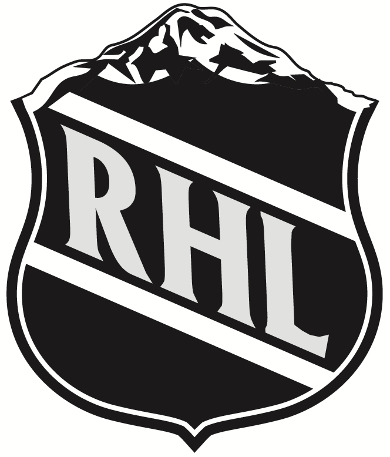

  

Rigged Hockey League
 

 

*The thing about rigging is, you can learn it if you become a master rigger but there's no book on rigging.*     

 Richard Serra 

 
*People feel like the system is rigged against them, and here is the painful part, they're right. The system is rigged.*     

 Elizabeth Warren 

## What is the RHL?
In a world where a good rig goes unappreciated, the Rigged Hockey League, henceforth RHL, was developed to let rigging shine. The only honourable thing is to quietly do something sketchy and hope no one notices.

 
 

## News

### 2025-2026 season
- See the [Beginning of the season FAQ](https://www.jeremylabrecque.org/rhl/#Beginning_of_season_FAQ) before you ask Gards or I any dumb questions
- Important dates: 
  - **Proposed Keeper deadline date:** TBD   
  - **Proposed draft dates:** TBD
  - **Friday, October 7:** First day of the NHL season

### 2024-2025
- Jeffa takes it all!
- First overall pick to Protect Ya Necas

### 2023-24 season
- Lance D'Rundell steals victory from Deluge to claim the 2023-2024 season
- First overall pick goes to Jeffa with a single point win over Flex
- October 15, 2023: Connor Dioxide Emissions is penalized, as per the [Penalties](#penalties) section of the Rules, a 4th round pick for failing to reach the basic standard of setting a proper lineup. 

 
 

## Beginning of season FAQ

- You can only select keepers on the website version, not in the app version. When you log into yahoo and click on your team, there will be a link at the top asking you to select your keepers
- When selecting your keepers, also select your farm team as keeper players
- Any player who is 23 or older on October 1st (i.e., born after Sept 30, 2001) must be brought up to your team for the beginning of the season, they cost 0 player years this year
- Trades can still be completed before you submit your keepers
- You can tell how many round of draft picks you'll have by subtracting the number of players you have kept (including farm team) from 19. For example, I have kept 12 players so I will draft up to an including round 7 (19-12). This doesn't take into account any previous trades or draft picks
- Draft Order:
  1. Protect Ya Necas
  2. Bag
  3. Suzuki Jimney
  4. Näslund of the Wind
  5. Стивен Прекрасный
  6. Lance D'Rundell
  7. Deluge of Gardseur
  8. Jeffa Petersburg
- Draft pick trades:
  - Bag 1st and 2nd round picks to Wind
  - Wind 5th and 6th round picks to Bag
  - Стивен 1st round to Deluge
  - Deluge 9th round to Стивен

## Rules

### Team Composition

Weekly active roster of:    

- 6 forwards     
- 3 defensemen     
- 1 goalie     

Non-active:      

- 4 bench players     
- 5 Farm Team players (Farm Team description below)

### Scoring

Goals = 1 point       
Assists = 1 point       
Wins = 2 points     
Shutouts = 2 points

### Roster Change Timelines

Weekly head-to-head matchups run Monday to Sunday
Inter-roster moves can be made until puck-drop in first Monday game
Add/drops and trades must be executed on Sunday to have effect for next week

### Cost & Prizes

Cost is $20 per year
Pooled money will be used to purchase a cryptocurrency at the start of season
First place wins 88% of season-end pot. Second place wins 12%.

### Farm Team

Consists of 5 players (F, D or G)
Farm Team players do NOT count towards a team’s Keeper Years Limit
Eligible Players must be 23 years old or younger as of October 1 every season
Updated Farm Team lists must be submitted immediately after the draft
     - If you do not have 5 eligible Farm Team players immediately after the draft, you must drop a player and pick up a player through Waivers/Free Agency to submit a legal roster
Farm players are NOT eligible to play in your Active Roster
Players eligible for the Farm Team obtained by trade during the season CAN be assigned to a team’s Farm Team, even if they have been part of another team’s Active Roster.
An Updated list of Farm Teams maintained in the Google Document tabs

### Draft

Active Rosters and Farm Teams are filled in the same Draft
Every draft will consist of 19 rounds (to fill 14 Active Roster and 5 Farm Team spots)
A kept player will take the place of a Draft Pick at the end of the Draft
     - For example, a team retaining 8 Active Roster players and 5 Farm team players (13 total) will have 6 picks in the Draft. These will represent picks 1 through 6 in the Draft. Picks 7 through 19 will be allocated to the returning players.
Traded Draft Picks in the Kept Players range will be re-distributed according to each team’s situation.
     - In the above example, if the team had traded it’s 14th pick in a deal for a 2nd round pick, the team would have it’s 6 selections in the first 5 rounds (1, 2, 2, 3, 4, 5). The 6th round pick would go to the other team instead of the 14th.

Draft order:

1. Winner of Sucker’s Delight (non-playoff team matchup)     
2. Loser of Sucker’s Delight (non-playoff team matchup)     
3. 5th Place Matchup Winner
4. 5th Place Matchup Loser
5. 3rd Place Matchup Winner           
6. 3rd Place Matchup Loser            
7. Rigged Cup runner-up           
8. Rigged Cup winner

Updated Farm Team lists must be submitted immediately after the draft.
     - If you do not have 5 eligible Farm Team players immediately after the draft, you must drop a player and pick up a player through Waivers/Free Agency to submit a legal roster.
New players to the Yahoo Players List can only be acquired via the draft. College players and others signing contracts at the end of the season are not eligible to be picked up via Waivers/Free Agency.

### Keeping Players

Each season you are allowed to keep 14 Keeper Years.
Every consecutive year a player is kept increases his Keeper Year cost.
     - For example, if you've had a player for 2 years and want to keep him for a third, he will cost 2 Keeper Years. A player you drafted that season or picked up via Free Agency would cost 1 Keeper Year to keep.
Farm Team players do NOT count towards the Keeper Year Limit  when kept
You do not have to keep all your Farm Team players

### Playoffs

The top 6 regular season teams make the playoffs
Playoffs take place over 3 weeks, ending the week before the end of the NHL’s regular season
Top 2 regular season teams get a Round 1 bye
Semi-final (Round 2) matchups are re-seeded
Rigged Cup (Championships) and Sucker’s Delight (2 non-playoff teams) take place during the same week

### Trades

Trades DO NOT reset Keeper Years
Trade deadline will be the last Wednesday of the league’s regular season
Off-season trades are allowed - trading will re-open after Rigged Cup has been awarded
There will be another trading hiatus between submission of Keeper Lists and the Draft
Equal number of picks from each team have to be included in a trade

### Injured Reserve

There are 4 IR+ spots you can use
You CANNOT put Farm Team players in IR spots
Injured players CANNOT be picked up directly to an IR+ spot

### Penalties

Failure to follow any of the rules above (setting incorrect keepers, failure to submit farm team, etc.) will result in losing a draft pick.
For a first infraction you lose a 4th round pick. For each additional infraction that pick moves up a round. So after 4 infractions you'd lose your first round pick.
Because Yahoo doesn't allow us to just take a draft pick away, your draft pick will be replaced with the WORST PLAYER IN THE LEAGUE. (Of course, you can just drop him after. But still, you lost your draft pick.)

## Keeper Lists {.tabset}
### Näslund of the Wind

|Main/farm |Player             | Keeper cost|
|:---------|:------------------|-----------:|
|Main      |Kirill Kaprizov    |           1|
|Main      |Jack Hughes        |           5|
|Main      |Rasmus Dahlin      |           2|
|Main      |Darren Raddysh     |           1|
|Main      |Robert Thomas      |           3|
|Main      |Lucas Raymond      |           1|
|Main      |Dylan Larkin       |           4|
|Main      |Drake Batherson    |           1|
|Main      |Sebastian Aho      |           1|
|Main      |Tom Wilson         |           1|
|Main      |John Carlson       |           2|
|Main      |Ryan O'Reilly      |           1|
|Main      |Josh Morrissey     |           1|
|Farm      |Alexander Nikishin |           0|
|Main      |Troy Terry         |           1|
|Main      |Ilya Sorokin       |           1|
|Farm      |Leo Carlsson       |           0|
|Farm      |Ivan Demidov       |           0|
|Farm      |Anton Frondell     |           0|
|Farm      |Tij Iginla         |           0|

### Deluge of Gardseur

|Main/farm |Player            | Keeper cost|
|:---------|:-----------------|-----------:|
|Main      |Nikita Kucherov   |           6|
|Main      |Jason Robertson   |           1|
|Main      |Mark Scheifele    |           2|
|Main      |Jake Guentzel     |           3|
|Main      |Aleksander Barkov |           2|
|Main      |Brayden Point     |           1|
|Main      |Adam Fox          |           4|
|Main      |Jackson LaCombe   |           2|
|Main      |Roman Josi        |           3|
|Farm      |Quinton Byfield   |           0|
|Main      |Jimmy Snuggerud   |           1|
|Main      |Noah Dobson       |           1|
|Main      |Pavel Zacha       |           1|
|Farm      |Seth Jarvis       |           0|
|Main      |Logan Thompson    |           2|
|Farm      |Yaroslav Askarov  |           0|
|Farm      |Juraj Slafkovský  |           0|
|Farm      |Adam Fantilli     |           0|
|Farm      |Will Smith        |           0|

### Jeffa Petersburg

|Main/farm |Player              | Keeper cost|
|:---------|:-------------------|-----------:|
|Main      |Cale Makar          |           4|
|Main      |Nick Suzuki         |           3|
|Main      |Jack Eichel         |           3|
|Main      |Matthew Tkachuk     |           2|
|Main      |Jakob Chychrun      |           2|
|Main      |J.T. Miller         |           3|
|Main      |Miro Heiskanen      |           1|
|Main      |Sam Bennett         |           1|
|Main      |Andrei Svechnikov   |           1|
|Main      |Nico Hischier       |           1|
|Main      |Nikolaj Ehlers      |           1|
|Main      |MacKenzie Weegar    |           1|
|Main      |Seth Jones          |           1|
|Main      |Frank Nazar         |           1|
|Main      |Brandon Bussi       |           1|
|Main      |Mackenzie Blackwood |           2|
|Farm      |Matvei Michkov      |           0|
|Farm      |Zeev Buium          |           0|
|Farm      |Berkly Catton       |           0|
|Farm      |Alexander Zharovsky |           0|
|Farm      |Caleb Desnoyers     |           0|

### Roscoe's Ovechkin 'N Wafflesv

|Main/farm |Player              | Keeper cost|
|:---------|:-------------------|-----------:|
|Main      |Connor McDavid      |           7|
|Main      |Alex DeBrincat      |           1|
|Main      |Artemi Panarin      |           3|
|Main      |Pavel Dorofeyev     |           1|
|Main      |Brock Nelson        |           1|
|Main      |Evgeni Malkin       |           1|
|Main      |Brad Marchand       |           1|
|Main      |Shayne Gostisbehere |           1|
|Main      |Jack Roslovic       |           1|
|Main      |Tyler Bertuzzi      |           1|
|Main      |Mike Matheson       |           1|
|Main      |Mattias Ekholm      |           1|
|Main      |Connor Hellebuyck   |           3|
|Main      |Jakub Dobes         |           1|
|Farm      |Matthew Schaefer    |           0|
|Farm      |Matty Beniers       |           0|
|Farm      |Marco Kasper        |           0|
|Farm      |Zachary Bolduc      |           0|
|Farm      |Cole Sillinger      |           0|

### Protect Ya Necas

|Main/farm |Player           | Keeper cost|
|:---------|:----------------|-----------:|
|Main      |Martin Necas     |           2|
|Main      |Matt Boldy       |           1|
|Main      |Brady Tkachuk    |           1|
|Main      |Mikko Rantanen   |           1|
|Main      |Brandon Hagel    |           2|
|Main      |Clayton Keller   |           2|
|Main      |Tim Stutzle      |           3|
|Main      |William Nylander |           6|
|Main      |Mitch Marner     |           2|
|Main      |Brock Faber      |           1|
|Main      |Victor Hedman    |           3|
|Main      |Charlie McAvoy   |           1|
|Main      |Thomas Chabot    |           1|
|Main      |Scott Wedgewood  |           1|
|Main      |Sergei Bobrovsky |           1|
|Farm      |Wyatt Johnston   |           0|
|Farm      |Cutter Gauthier  |           0|
|Farm      |Cole Hutson      |           0|
|Farm      |Brandt Clarke    |           0|
|Farm      |Jacob Fowler     |           0|

### Suzuki Jimney

|Main/farm |Player             | Keeper cost|
|:---------|:------------------|-----------:|
|Main      |Leon Draisaitl     |           7|
|Main      |Zach Werenski      |           2|
|Main      |Auston Matthews    |           1|
|Main      |Cole Caufield      |           2|
|Main      |Tage Thompson      |           2|
|Main      |Jake Sanderson     |           2|
|Main      |Moritz Seider      |           3|
|Main      |Dylan Holloway     |           1|
|Main      |Bo Horvat          |           1|
|Main      |Trevor Zegras      |           1|
|Main      |Alex Tuch          |           1|
|Main      |Elias Pettersson   |           4|
|Main      |Dougie Hamilton    |           1|
|Main      |Luke Hughes        |           1|
|Main      |Andrei Vasilevskiy |           2|
|Main      |Igor Shesterkin    |           1|
|Farm      |Macklin Celebrini  |           0|
|Farm      |Lane Hutson        |           0|
|Farm      |Dylan Guenther     |           0|
|Farm      |Connor Bedard      |           0|

### Lance D’Rundell

|Main/farm |Player            | Keeper cost|
|:---------|:-----------------|-----------:|
|Main      |David Pastrnak    |           4|
|Main      |Evan Bouchard     |           3|
|Main      |Kyle Connor       |           2|
|Main      |Adrian Kempe      |           1|
|Main      |Filip Forsberg    |           3|
|Main      |Jesper Bratt      |           3|
|Main      |Logan Cooley      |           1|
|Main      |Nick Schmaltz     |           1|
|Main      |Travis Konecny    |           2|
|Main      |Mikhail Sergachev |           1|
|Main      |Shea Theodore     |           1|
|Main      |Thomas Harley     |           2|
|Main      |Jake Oettinger    |           3|
|Main      |Filip Gustavsson  |           1|
|Farm      |Beckett Sennecke  |           0|
|Farm      |William Eklund    |           0|
|Farm      |Michael Misa      |           0|
|Farm      |Mason McTavish    |           0|
|Farm      |Zayne Parekh      |           0|

### Стивен Прекрасный

|Main/farm |Player           | Keeper cost|
|:---------|:----------------|-----------:|
|Main      |Nathan MacKinnon |           7|
|Main      |Quinn Hughes     |           4|
|Main      |Sam Reinhart     |           2|
|Main      |Sidney Crosby    |           2|
|Main      |Kirill Marchenko |           2|
|Main      |Roope Hintz      |           1|
|Main      |Mika Zibanejad   |           1|
|Main      |Erik Karlsson    |           1|
|Main      |Mark Stone       |           1|
|Main      |Bryan Rust       |           1|
|Main      |Matthew Knies    |           1|
|Main      |Rickard Rakell   |           1|
|Main      |Morgan Geekie    |           1|
|Main      |Mathew Barzal    |           1|
|Main      |Vince Dunn       |           1|
|Main      |Karel Vejmelka   |           1|
|Main      |Joel Hofer       |           1|
|Farm      |Porter Martone   |           0|
|Farm      |Gabe Perreault   |           0|
|Farm      |Ryan Leonard     |           0|
|Farm      |Igor Chernyshov  |           0|
|Farm      |James Hagens     |           0|

 
 

## Hall of Champions Virtual Plaque

- 2020: No champion (COVID)
- [2021: Suzuki Jimney](https://www.jeremylabrecque.org/rhl/2021_playoffs)
- [2022: Suzuki Jimney](https://www.jeremylabrecque.org/rhl/2022_playoffs)
- [2023: Connor Dioxide Emissions](https://www.jeremylabrecque.org/rhl/2023_playoffs)
- [2024: Lance D'Rundell](https://www.jeremylabrecque.org/rhl/2024_playoffs)
- [2025: Jeffa Petersburg](https://www.jeremylabrecque.org/rhl/2025_playoffs)

## All-time standings

|Team                         | 1st| 2nd| 3rd| 4th| 5th| 6th| 7th| 8th| Total|
|:----------------------------|---:|---:|---:|---:|---:|---:|---:|---:|-----:|
|Deluge of Gardseur           |   0|   4|   0|   0|   0|   1|   0|   0|    31|
|Suzuki Jimney                |   2|   0|   1|   0|   1|   0|   1|   0|    28|
|Стивен Прекрасный            |   0|   0|   2|   1|   2|   0|   0|   0|    25|
|Näslund of the Wind          |   1|   0|   2|   0|   0|   1|   0|   1|    24|
|Lance D'Rundell              |   1|   0|   0|   2|   0|   1|   1|   0|    23|
|Protect Ya Necas             |   0|   1|   0|   1|   2|   0|   1|   0|    22|
|Jeffa Petersburg             |   1|   0|   0|   1|   0|   1|   1|   1|    19|
|Roscoe's Ovechkin 'N Waffles |   0|   0|   0|   0|   0|   1|   1|   3|     8|
