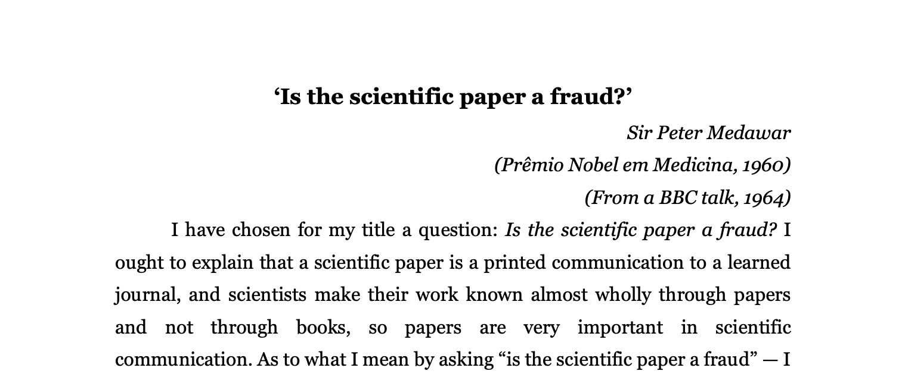

## Next session
**Date:** December 10, 2021 at 1pm       
**Paper to be discussed:** ["Is the scientific paper a fraud?"](http://www.brown.uk.com/teaching/HEST5001/medawar.pdf)

 
 
 
 

## Fall 2021 Schedule

|Date|Reference|Paper|
|:--- |:--- |:---------- |
|November 26|Nimdet et al 2015|[A Systematic Review of Studies Eliciting Willingness-to-Pay per Quality-Adjusted Life Year: Does It Justify CE Threshold?](https://journals.plos.org/plosone/article?id=10.1371/journal.pone.0122760)|
|November 12|Haber et al 2021|[Causal and Associational Language in Observational Health Research\: A systematic evaluation](https://www.medrxiv.org/content/10.1101/2021.08.25.21262631v4.full.pdf)|
|October 29|Greenland 2021|[Dealing With the Inevitable Deficiencies of Bias Analysis-and All Analyses](https://pubmed.ncbi.nlm.nih.gov/33778862/)|
|October 15|MacLehose et al 2021|[The Importance of Making Assumptions in Bias Analysis](https://pubmed.ncbi.nlm.nih.gov/34224472/)|
|October 1| | CANCELLED |
|September 17| | CANCELLED |
|September 3| | Epidemiology X |
   
   
     
## Sign-up for the Winter 2022 Schedule   
 
[**Sign-up to present at Journal Club**](https://docs.google.com/forms/d/e/1FAIpQLScjzMfl2dQ_TY1BtRYJ45LCD50VLgIrw6Vk_8rBmtfo0IxnSQ/viewform?usp=sf_link)   

## The idea behind journal club

I just wanted to take a few minutes to write down a bit about the philosophy behind journal club. The main idea behind the journal club in our department is to have a place to discuss ideas, whether new or old, in an atmosphere that is open and inclusive. A place where anyone can participate, there are no wrong or stupid questions, and we move together as a group to better understand the topic of discussion.

I also want to add that there is also benefit to attending even if you don't fully understand the topic or speak during the meeting. I encountered many epi concepts for the first time in a journal club and, while I might have left with only a vague understanding, when I did re-encounter the concept later in the classroom, I was already familiar with it making it easier to learn. So I encourage attendance even just to observe the conversation.

It's also a great place to sharpen your "thinking on your feet" and scientific creativity skills. The conversations in journal club don't tend to be always go where we expect them to and I love hearing new ideas or new perspectives on old ideas and I don't know where I would encounter those ideas otherwise!

Lastly, journal club can expose you to new topics. I discovered the topic, method and datas et that I used in PhD at the social epidemiology journal club at McGill (in different sessions) so you never know what you're going to come away with when you attend. 

Let me know if you have any ideas for the journal club. Looking forward to future meetings!

## Journal club helps you use concepts you use in class

After my undergrad I was accepted to a 6-month internship in Brazil. I spoke absolutely no Portuguese and Duolingo had not yet been invented. But because no one spoke English in my environment, I picked up the ability to speak easily in Portuguese in 3 months.

Switch to the present day and despite have been in the Netherlands for more than four years now and my Dutch still pretty bad despite completing two Dutch courses and finishing the Duolingo course multiple times. I can have basic conversations but it's hard for me to converse about anything beyond the weather.

Why this difference? Because in Brazil I was forced to speak and listen every day. I was _using_ Portuguese, not just learning it. For Dutch, I learned almost everything I need to know to be able to converse but I haven't used what I learned because everyone speaks English here so I'm never forced to use it! This makes all the difference in the world.

Learning new concepts in epidemiology or on any topic works the same way. You can learn concepts in class and even get great grades in the classes. But if you don't use what you learn, you don't develop the same kind of expertise. Taking classes is the first step of the learning process but using that knowledge as much as possible is what will make it much easier for you to use these concepts in daily practice and make you an expert.
