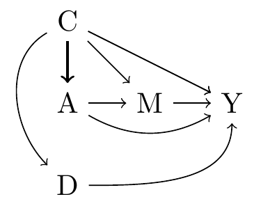

Deciding what to adjust for is not a straightforward process. It requires subject matter about the variables in your analysis but also a good grasp of causal inference. The causal inference part is required because intuitions about what to adjust for can lead us astray. The classic example of this is the desire to adjust for mediators in an analysis. I get the intuition for why people want to do that but it's clear that in doing so you'll be answering a different question and incorrectly I might add.

Another case when people's intuition leads them astray is with really strong confounders. In the causal graph below we're interested in the effect of A on Y but we're not sure whether to adjust for C. On the graph it's clear that you should but if you're thinking about this problem from a purely substantive standpoint, there might be a temptation to say, "C is really correlated with A and it causes all these other things that are strongly correlated with A (D,M). If I adjust for C I'll be adjusting away the effect of A." 

Here the intuition is pointing in exactly the wrong direction. C is a really strong confounder and must be adjusted for. Because it's such a strong confounder, it makes sense that the relationship gets smaller when you adjust for it. In fact, if C is _really_ strongly related to A, it's possible that after adjusting for C, there's little variation leftover in A meaning you have little precision and, possibly, a positivity violation. The latter two aren't reasons you shouldn't adjust for C, they're reasons that you question isn't answerable with the data you have.

People with a background in causal inference might think this post is a no-brainer but this reasoning happens. And the fact that it happens demonstrates that it isn't enough to use your intuition to decide what you should adjust for. If you're questioning whether or not to adjust for a variable, draw a causal graph and, more often than not, it will give you the answer.

