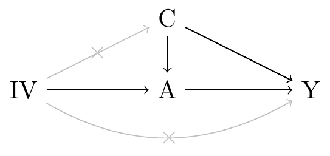
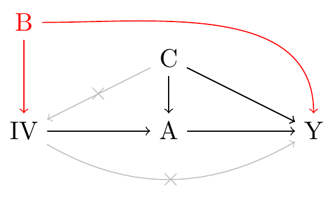
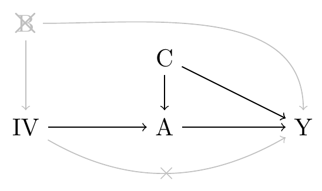

I read a lot of instrumental variable (IV) papers and most include a description of the IV assumptions. Given that IV analyses are popular in different fields, it isn't surprising that there is a lot of variability in how they are stated. There is more than one way they can be stated accurately. But sometimes it's clear there has been some confusion. Below is a causal graph I often encounter in the epidemiology literature:

Sometimes the arrow from $IV$ to $C$ goes in other direction or I've even seen it bidirectional.

It not easy to depict visually the IV assumptions because it involves trying to show the absence of arrows, i.e. the grey arrows above. But this one gets it wrong in a couple different ways.

First the arrow from $IV$ to $C$ is showing another exclusion restriction violation where the exclusion restriction is the assumption that the instrument $IV$ does not affect the outcome $Y$ except through treatment $A$. Both the direct arrow from $IV$ to $Y$ and from $IV$ to $C$ show exclusion restriction violations.

If you reverse the $IV$-$C$ arrow, it's not longer an exclusion restriction violation but shows a violation of indepence--the assumption that the instrument $IV$ does not share any causes with the outcome $Y$. But this isn't a complete picture of the independence assumption because it only says that exposure-outcome confounders can be related to $IV$. The variable $B$ below violates independence in a way that would not be capture in the causal graph above:  

The confusion, I think, is that some versions of the IV assumptions make reference to the exposure-outcome confounders:
  
  (1a) The instrument is associated with the exposure
  (1b) The instrument is independent of the outcome given the exposure and all confounders (measured and unmeasured) of the exposure–outcome association (i.e., the exclusion restriction)
  (1c) The instrument is independent of factors (measured and unmeasured) that confound the exposure–outcome relationship
  
While others don't:

  (2a) The instrument is associated with the exposure
  (2b) The instrument the instrument $IV$ does not affect the outcome $Y$ except through treatment $A$ (exclusion restriction)
  (2c) The instrument $IV$ does not share any causes with the outcome $Y$
  
Both sets are valid descriptions of the IV assumptions but, to me, the first set has two drawbacks. First, it makes mention of the exposure-outcome confounders. We use IV analyses because we believe that we can't identify all unmeasured confounders so why include them in our definition of an IV? Including a set of variables that we admit a priori that we can't identify in our definition of an IV seems self-defeating. It's impossible to think clearly about the IV assumptions in these terms if we don't know the set of all exposure-outcome confounders. The second drawback is that it's harder to depict graphically.

The second set of assumption makes no reference to exposure-outcome confounders which means that the assumptions are in terms that we can think more clearly about: basically our instrument can only cause the outcome through the exposure and it can't be confounded with the outcome. And the can be depicted graphically more easily:

Another note is that not everyone uses 'exclusion restriction' to mean the same thing. Assumption 1b.is saying something both about the non-existence of direct effects of $IV$ on $Y$ but also about independence (conditional on $A$ and $C$). It's a mix of assumptions 2b. and 2c. from the second set. Assumption 2b. says the exclusion restriction is only about direct effects of $IV$ on $Y$. Note that Assumption 1c. has to be included in the first set to, in some sense, complete the independence assumption in 1b. to include the variables in $C$. In my view, this is another reason to prefer the second set because it keeps the ideas of direct effects and confounding separate.

All this to say that there are multiple valid versions of the IV assumptions. When working with one set, it's important to not confuse it with another set. 

