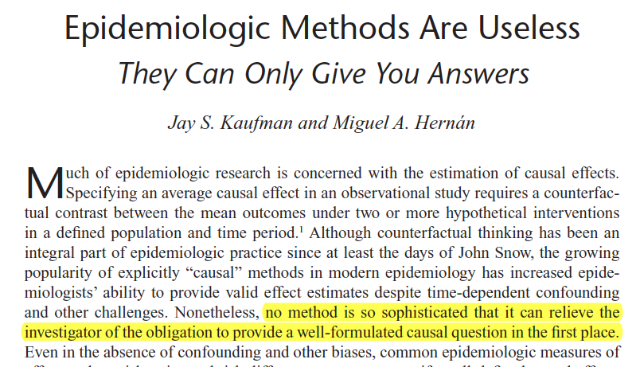

Think about all the courses you took as part of your training. How many of them were about how to get good answers to research questions? And how many were about how to formulate good research questions? As was nicely said by Kaufman and Hernan:

I co-teach a course called Study Design which is a kind of Epidemiology 101 course and the great majority is all about how to answer questions. Relatively little about how to ask questions (although I'm trying to add more every year). I also co-teach a short Mendelian randomization course and there it's mostly the same story. Mendelian randomization is, really, only a way to answer questions but we have to be able to know what is our question of interest and whether it matches with what Mendelian randomization can estimate. 

Every biostats course I've ever taken has only been about answering questions with very little about how to ask good questions. It occurred to me that maybe we should be learning how to ask questions in courses about substantive topics like social epidemiology or clinical epidemiology. But in my experience, those courses teach about those fields without necessarily teaching you how to ask a good question.

And bad questions are rampant. People often phrase their questions very vaguely in terms of how some exposure is related to some outcome. But there is a lot more that goes into questions than that. [Here is a good example from a commentary I co-authored](https://pubmed.ncbi.nlm.nih.gov/37857434/) about how not thinking the question all the way through can lead to the incorrect analysis. [Here's another example from a review of causal questions in the ICU](https://pubmed.ncbi.nlm.nih.gov/38012221/) where the authors find that most papers are answering questions about point treatments (intervening at one point in time) rather than sustained or time-varying treatments which is often more of interest. 

Here are some resources for asking good research questions but, in my opinion, we're still missing a good paper about how to come up with good research questions:

- Kaufman and Hernan 2012. [Epidemiologic Methods Are Useless They Can Only Give You Answers](https://journals.lww.com/epidem/Fulltext/2012/11000/Commentary___Epidemiologic_Methods_Are_UselessThey.3.aspx)
- Vanderbroucke and Pearce 2018. [From ideas to studies: how to get ideas and sharpen them into research questions](https://www.ncbi.nlm.nih.gov/pmc/articles/PMC5846748/)
- Yanai and Lercher 2019. [What is the question?](https://genomebiology.biomedcentral.com/articles/10.1186/s13059-019-1902-1)
- Snowden, Reavis and Odden 2020 [Conceiving of Questions Before Delivering Analyses](https://pubmed.ncbi.nlm.nih.gov/32501813/)
- Hernan and Robins 2016. [Using Big Data to Emulate a Target Trial When a Randomized Trial Is Not Available](https://pubmed.ncbi.nlm.nih.gov/26994063/)

