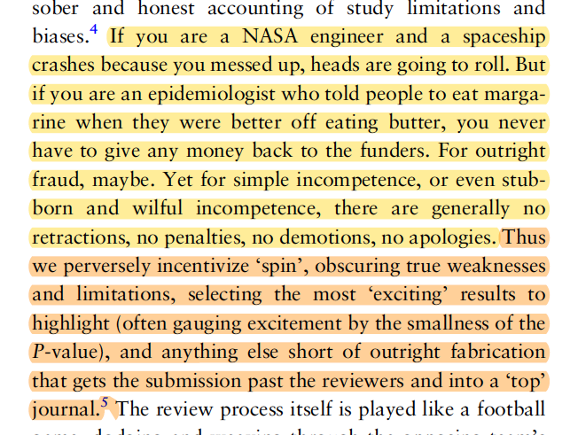

Something that really saps my motivation is how genuinely terrible studies are published on a daily basis.

I remember how shocked I was the first time I recognized something in a published paper that was a giant error. It was back when I was an ecologist and someone published a principal component analysis without standardizing the variables find, surprise surprise, that the variable with the largest natural scale loaded *REALLY* heavily on the first component. In my naivete, I felt like I'd just observed a black swan--one of the rare times something bad got through peer review.

After spending so much time thinking and reading about research methods, I've learned that these types of extreme research errors are a common occurrence. And I think that it's so common that we fail to realize how grave these errors are. Whenever I catch a mistake in the literature now I force myself to take a second and really think about the nature of the error. And I've sort of roughly categorized some types of errors as "type ?!?! errors". To me, a type ?!?! error is one that should NEVER get past peer review. Here is a small list that I will add to in the future:

- Misinterpretation of significance tests (e.g. claim no effect even when the confidence interval is extremely wide)
- Adjusting for mediators when targeting the total effect
- Throwing a mediator into a model to target the direct effect
- Rejecting proposed instruments because they are still significantly associated with the outcome after adjusting for the exposure

And I want to emphasize that I don't think the blame lays only with the people who are making these mistakes. We need much better education in epidemiologic methods and we need much more [collaboration with methodologists](https://www.jeremylabrecque.org/post/improving_methods/).

Editing this post to add reference to this paper, [Cynical Epidemiology](https://academic.oup.com/ije/article-abstract/49/5/1507/5864441) which makes this point: 

