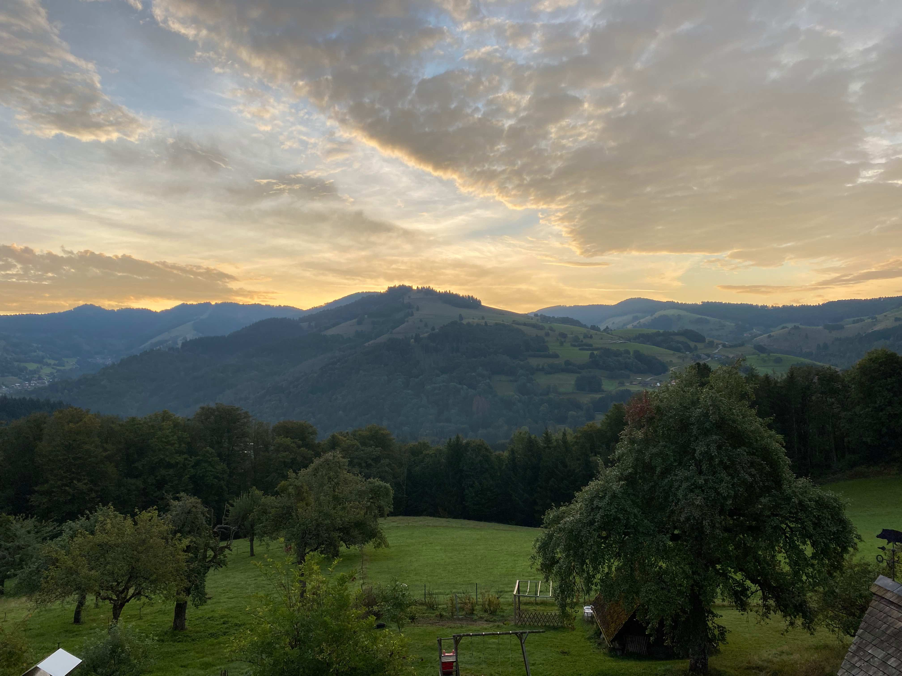
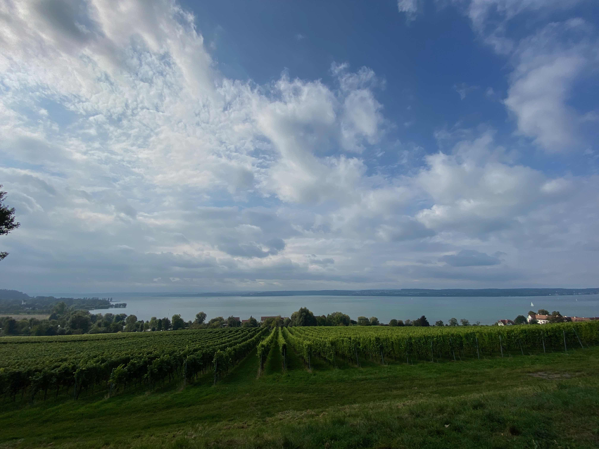
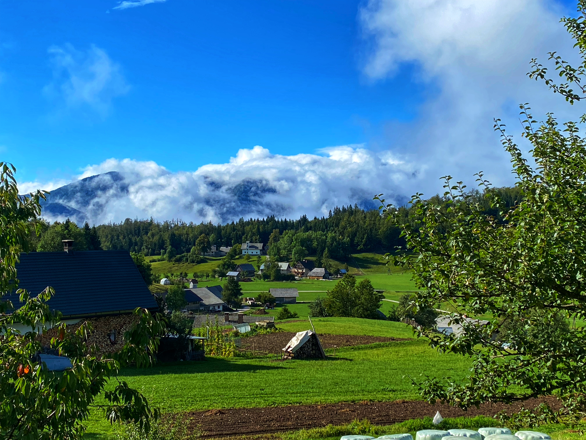

## Day 1: Leaving Rotterdam

Rough trajectory of our Day 1 drive: 

<iframe src="https://www.google.com/maps/embed?pb=!1m28!1m12!1m3!1d113790.28149838903!2d5.696465490571246!3d49.57148108845754!2m3!1f0!2f0!3f0!3m2!1i1024!2i768!4f13.1!4m13!3e0!4m5!1s0x47c5cce0bff456b7%3A0xfcf1d38e0411a5f7!2sTheeroos%2067%2C%203068%20BZ%20Rotterdam%2C%20Netherlands!3m2!1d51.957020899999996!2d4.5304787!4m5!1s0x4791aad62136abf3%3A0x1d5a01240ad95d29!2sHirtenbrunnen%2C%20Hof%204%2C%2079677%20Fr%C3%B6hnd%2C%20Germany!3m2!1d47.7710851!2d7.8713831999999995!5e0!3m2!1sen!2snl!4v1633208533066!5m2!1sen!2snl" width="600" height="450" style="border:0;" allowfullscreen="" loading="lazy"></iframe>

Our plan was to drive through five countries on our first day: the Netherlands, Belgium, Luxembourg, France and Germany. But Luxembourg is so small that I missed one turn and that made us literally miss all of Luxembourg. Luckily we caught it on the way back. We stayed one night in a cool inn/hotel with creaky floors but an amazing view:

## Day 2: Arriving in Slovenia

Longer drive on Day 2: 

<iframe src="https://www.google.com/maps/embed?pb=!1m28!1m12!1m3!1d2776156.671987995!2d8.720516307496176!3d47.195241167238706!2m3!1f0!2f0!3f0!3m2!1i1024!2i768!4f13.1!4m13!3e0!4m5!1s0x4791aad62136abf3%3A0x1d5a01240ad95d29!2sHirtenbrunnen%2C%20Hof%204%2C%2079677%20Fr%C3%B6hnd%2C%20Germany!3m2!1d47.7710851!2d7.8713831999999995!4m5!1s0x477a92866fed8b2d%3A0x2cfd99a8cb283685!2sKoprivnik%20v%20Bohinju%2049%2C%20Bohinjska%20Bistrica%2C%20Slovenia!3m2!1d46.3106894!2d13.984584199999999!5e0!3m2!1sen!2snl!4v1633208749093!5m2!1sen!2snl" width="600" height="450" style="border:0;" allowfullscreen="" loading="lazy"></iframe>

We got to see Lake Constance along the way: 

You have to buy special vignettes to stick to your windshield in both Austria and Slovenia which makes sense because a lot of people drive through those countries, using the roads, without spending much money there. So the vignettes are a way to get people to pay into the roads. It rained on our drive through Austria but there were a lot of cool tunnels including one that was over 7km long. It was also cool that at one point the traffic stopped and everyone in the left lane pulled over onto the left shoulder and everyone in the right lane pulled over onto the right shoulder. This way emergency vehicles can easily get through. On the trip back we saw a massive crash on the other side of the highway where the emergency vehicles were flying up the highway this way (there was a also a helicopter that landed on the highway).

## Day 3: Slap Savica

We woke up to this view from our AirBnB:

We were staying in the tiny village of Koprivnik v Bohinju on the Pokljuka Plateau. [Wikipedia says it has about 214 inhabitants.](https://en.wikipedia.org/wiki/Koprivnik_v_Bohinju) Everyone we met there was super nice and almost everyone spoke really good English (just like everyone else we met in Slovenia). The [Juliana Trail](https://www.bohinj.si/en/experiences/juliana-trail/) goes right through town and we saw a couple confused hikers. Another interesting thing is that there are no fences separating properties. In fact, we didn't see fences anywhere on the Pokljuka plateau except small portable fences sometimes for a few cows or a horse. Most livestock could run free. 

### Slap Savica

"Slap" is Slovenian for "waterfall". The main road to get out of Koprivnik to the rest of civilization was under construction so we had to take other roads. Here is a sample of the type of roads we were driving on:

<iframe src="https://www.google.com/maps/embed?pb=!1m34!1m12!1m3!1d11024.754976120203!2d13.961149640061882!3d46.30608891591702!2m3!1f0!2f0!3f0!3m2!1i1024!2i768!4f13.1!4m19!3e0!4m5!1s0x477a92866fed8b2d%3A0x2cfd99a8cb283685!2sKoprivnik%20v%20Bohinju%2049%2C%20Bohinjska%20Bistrica%2C%20Slovenia!3m2!1d46.3106894!2d13.984584199999999!4m5!1s0x477a8d730e80febb%3A0x90704a0221e0954e!2sPodjelje%2C%20Srednja%20vas%20v%20Bohinju%2C%20Slovenia!3m2!1d46.3132008!2d13.9599631!4m5!1s0x477a92a18ba7e427%3A0x4ae9c34a320193ed!2sJereka%2C%20Slovenia!3m2!1d46.296589399999995!2d13.9615218!5e0!3m2!1sen!2snl!4v1633253200572!5m2!1sen!2snl" width="600" height="450" style="border:0;" allowfullscreen="" loading="lazy"></iframe>

Narrow, one-lane roads with two way traffic. If you met someone coming the other way, one of you had to find a place to pull over to allow the other through. Worst still, hairpin turns where, on one side, the shoulder went almost straight down into the valley where often there were cattle grazing or sometimes people working. It didn't take too long to get reasonably comfortable driving along these roads but what I can't believe is that they use them in winter with snow and ice. 

