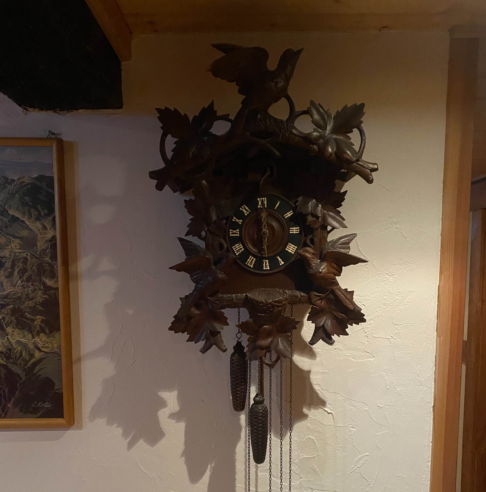

---

title: Slovenia

date: "2018-06-28T00:00:00Z"

reading_time: false # Show estimated reading time?
output: md_document
---

## Leaving Rotterdam

Our plan was to drive through five countries on our first day: the Netherlands, Belgium, Luxembourg, France and Germany. But Luxembourg is so small that I missed one turn and that made us literally miss all of Luxembourg. Luckily we caught it on the way back. We stayed one night in a cool inn/hotel with creaky floors but an amazing view. 

