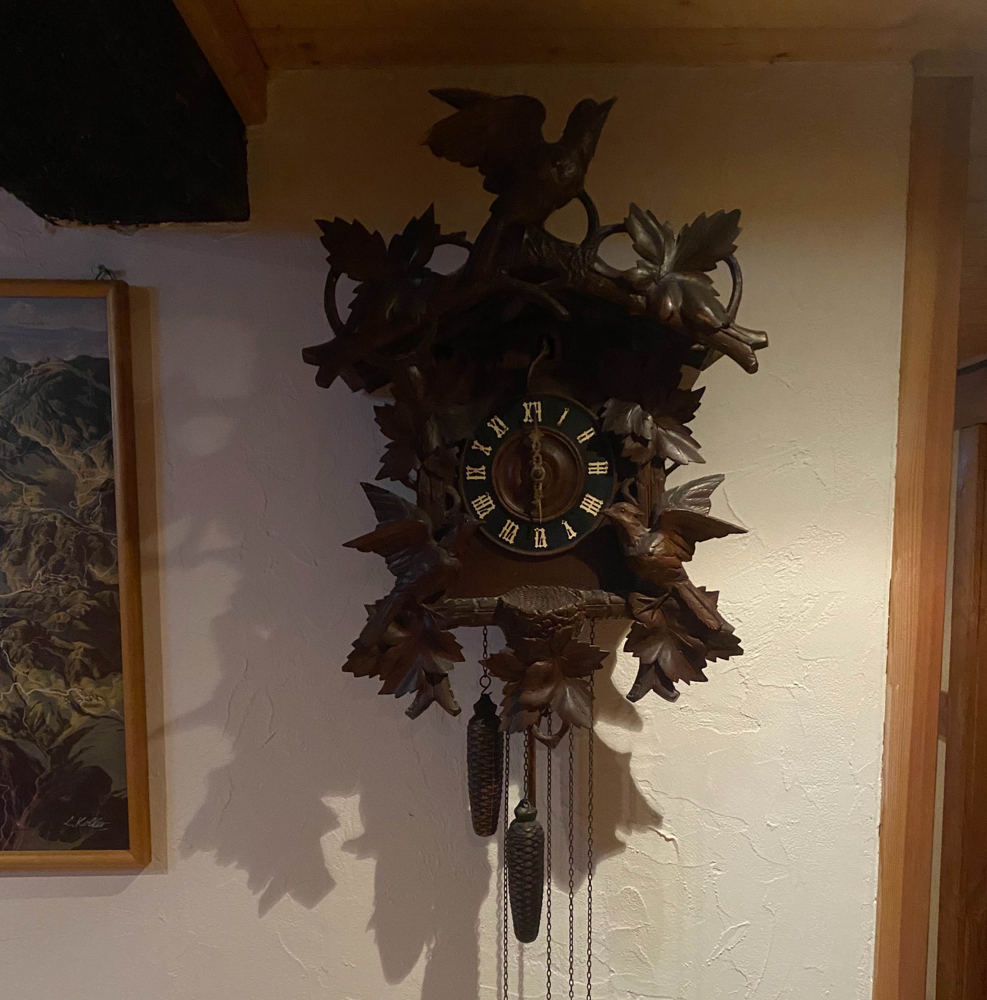

## Leaving Rotterdam

Our plan was to drive through five countries on our first day: the Netherlands, Belgium, Luxembourg, France and Germany. But Luxembourg is so small that I missed one turn and that made us literally miss all of Luxembourg. Luckily we caught it on the way back. We stayed one night in a cool inn/hotel with creaky floors but an amazing view. 

<iframe src="https://www.google.com/maps/embed?pb=!1m14!1m8!1m3!1d394089.6695114243!2d7.663071086293615!3d47.822543218944304!3m2!1i1024!2i768!4f13.1!3m3!1m2!1s0x0%3A0x1d5a01240ad95d29!2sHirtenbrunnen!5e0!3m2!1sen!2snl!4v1633205526548!5m2!1sen!2snl" width="600" height="450" style="border:0;" allowfullscreen="" loading="lazy"></iframe>

Pretty cool place
