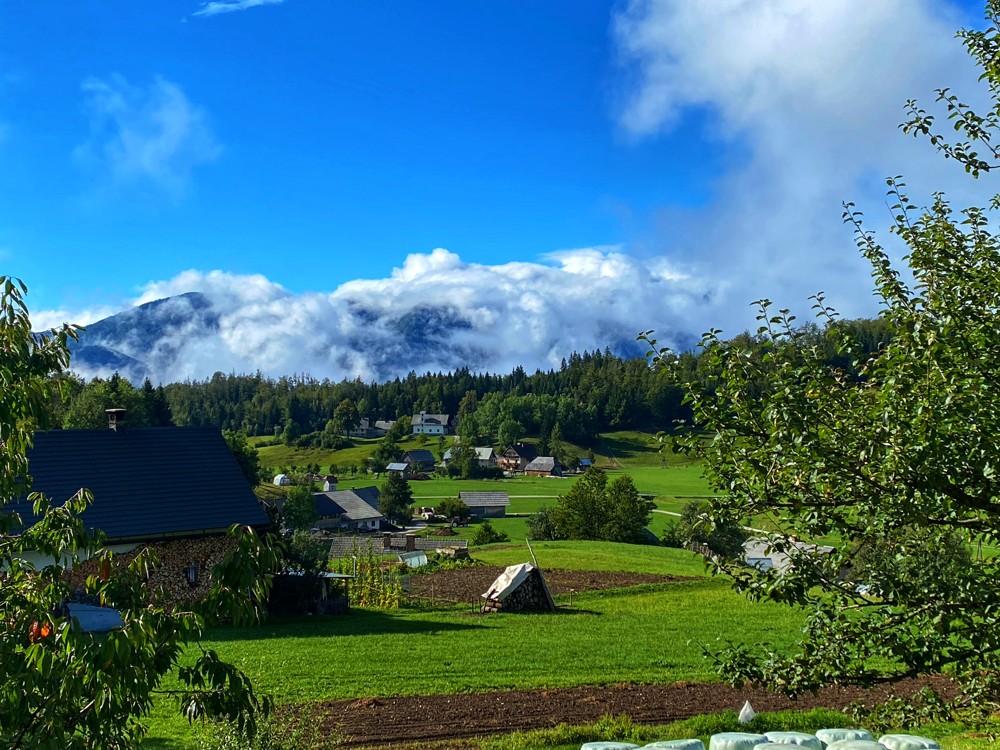

[Back to Days 1-2](https://www.jeremylabrecque.org/slovenia/)

## Day 3: Slap Savica

We woke up to this view from our AirBnB:

We were staying in the tiny village of Koprivnik v Bohinju on the Pokljuka Plateau. [Wikipedia says it has about 214 inhabitants.](https://en.wikipedia.org/wiki/Koprivnik_v_Bohinju) Everyone we met there was super nice and almost everyone spoke really good English (just like everyone else we met in Slovenia). The [Juliana Trail](https://www.bohinj.si/en/experiences/juliana-trail/) goes right through town and we saw a couple confused hikers. Another interesting thing is that there are no fences separating properties. In fact, we didn't see fences anywhere on the Pokljuka plateau except small portable fences sometimes for a few cows or a horse. Most livestock could run free. 

### Slap Savica

"Slap" is Slovenian for "waterfall". The main road to get out of Koprivnik to the rest of civilization was under construction so we had to take other roads. Here is a sample of the type of roads we were driving on:

<iframe src="https://www.google.com/maps/embed?pb=!1m34!1m12!1m3!1d11024.754976120203!2d13.961149640061882!3d46.30608891591702!2m3!1f0!2f0!3f0!3m2!1i1024!2i768!4f13.1!4m19!3e0!4m5!1s0x477a92866fed8b2d%3A0x2cfd99a8cb283685!2sKoprivnik%20v%20Bohinju%2049%2C%20Bohinjska%20Bistrica%2C%20Slovenia!3m2!1d46.3106894!2d13.984584199999999!4m5!1s0x477a8d730e80febb%3A0x90704a0221e0954e!2sPodjelje%2C%20Srednja%20vas%20v%20Bohinju%2C%20Slovenia!3m2!1d46.3132008!2d13.9599631!4m5!1s0x477a92a18ba7e427%3A0x4ae9c34a320193ed!2sJereka%2C%20Slovenia!3m2!1d46.296589399999995!2d13.9615218!5e0!3m2!1sen!2snl!4v1633253200572!5m2!1sen!2snl" width="600" height="450" style="border:0;" allowfullscreen="" loading="lazy"></iframe>

Narrow, one-lane roads with two way traffic. If you met someone coming the other way, one of you had to find a place to pull over to allow the other through. Worst still, hairpin turns (which look worse in real life than they do on the map) where, on one side, the shoulder went almost straight down into the valley where often there were cattle grazing or sometimes people working. It didn't take too long to get reasonably comfortable driving these roads but what I can't believe is that they use them in winter with snow and ice. 

On our first full day in Slovenia, the clouds were too low to see the tops of the mountains which kept the mystery:

\vspace{10mm}

Our short hike to Slap Savica started by a river: 

Climbed up past a parking lot where the lazy people start:

With some nice views on Bohinj Valley and Lake Bohinj:

And then to Savica which was nice and tucked away in the mountains:

Then we had a typical Slovenian lunch (Bohinj trout and klobasa) on the shores of Bohinj:

\vspace{10mm}

