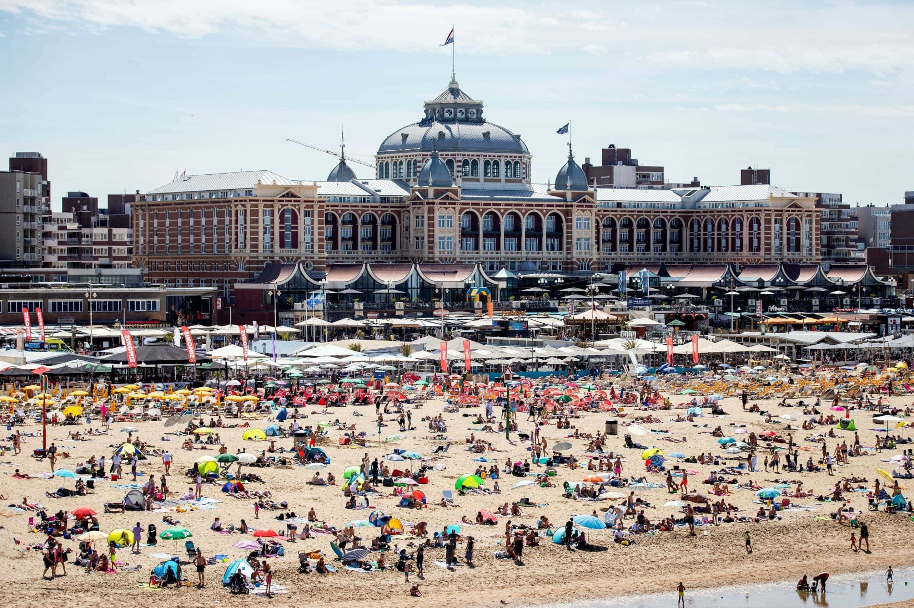
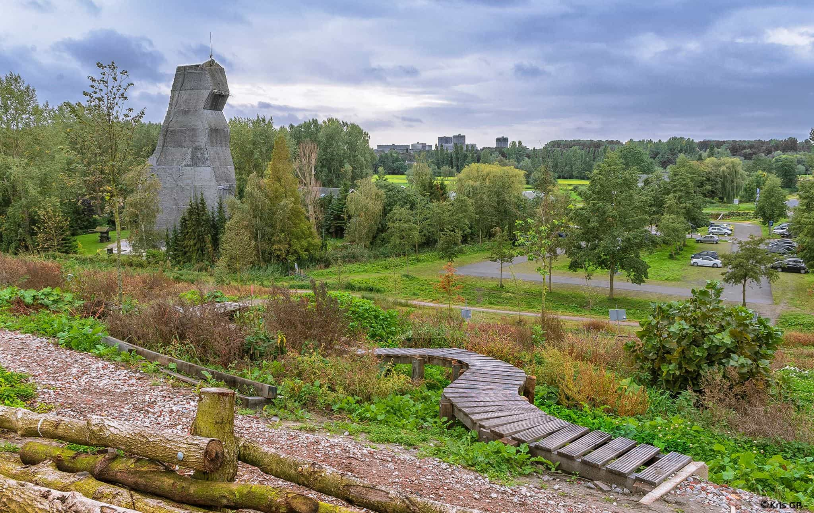
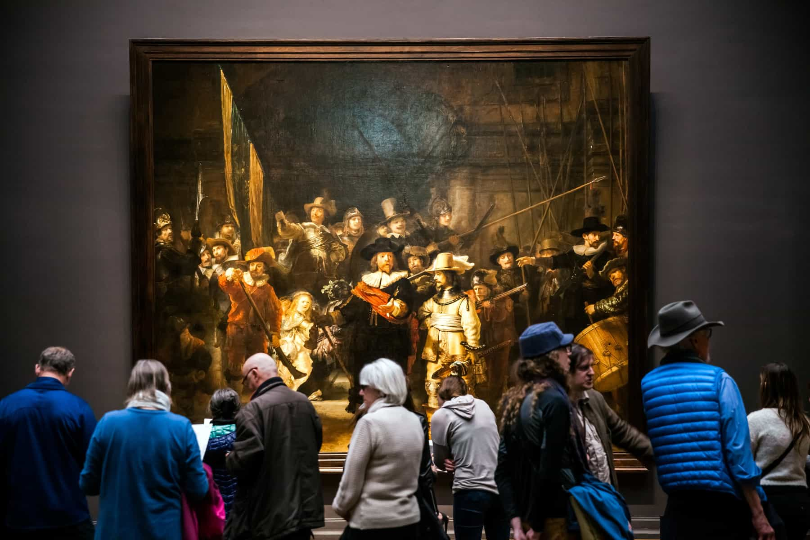
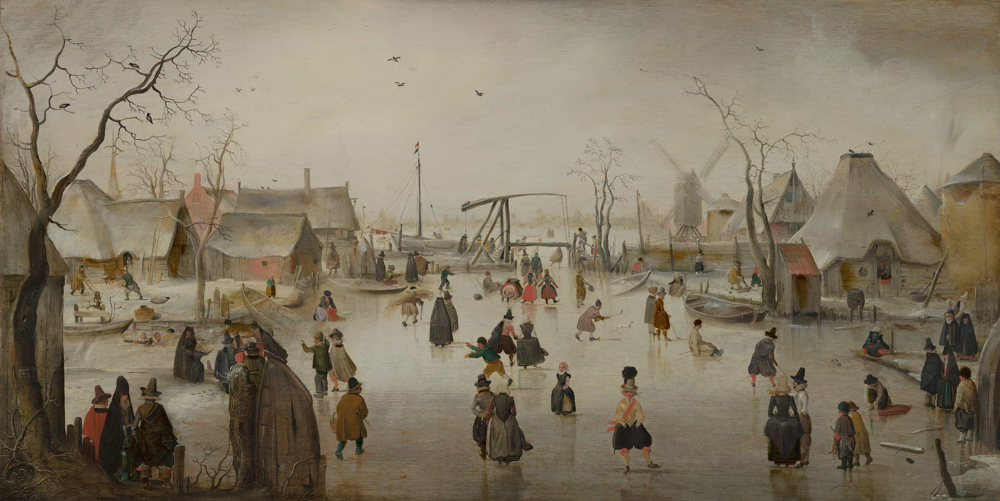

```{r load_packages, message=FALSE, warning=FALSE, include=FALSE} 
library(fontawesome)
```

</br>
</br>

## Welcome to Theeroos and the Netherlands


We've put together a list of things you can do when you visit us.


</br>
</br>

---

## Biking


There are bike paths EVERYWHERE. Here's a [map of the bike path network](https://www.route.nl/routeplanner) but I'll save you a click because if you want to go anywhere in the Netherlands, you can bike there on a bike path. Sometimes I'm biking in a super rural place and I'm like, "why is there even a bike path here?" A couple things you need to know to bike here.

<b>Signal when you turn.</b> In Canada most people don't signal but here most people do. It avoids confusion when coming up to an intersection. All you do is hold out your arm on the side you intend to turn. Easy peasy. 

<b>You need front and back bike lights at night.</b> Sometimes I forget my lights and it can be dangerous when you're biking in a place where there's less lighting. And the most dangerous part is other bikes not seeing you.

<b>Bells!</b> The inner Montrealer in me still finds it irritating but people use bells all the time if they want to pass you and you're in the way. It's not meant to be aggressive. It's also a legel requirement that all bikes have a working bell.

-1024x687.jpg)

<b>Know when you have the right of way.</b> And that's not too complicated because as a cyclist in the Netherlands you mostly always have the right of way. You have to stop for emergency vehicles, public transit and pedestrians at crosswalks. Triangles on the pavement pointing at you also indicate when you don't have right of way. They indicate that you must yield to other cyclists, drivers and pedestrians. So in the photo above, someone coming into the roundabout from the right would have to let other cyclists pass before entering the roundabout, whereas the cyclist in the roundabout has the right of way. It's not as hard as it sounds.  

<b> You can bring your bike on the train or the metro.</b> There are designated cars where you can bring your bike, usually at the front and end of the train or metro. They will have a picture of the bike on the door. Note that you can't bring a bike on the train or metro during rush hour. So not between 6h30 and 9h or between 16h and 18h30 on weekdays.


</br>

### To the A12 along the Rotte River
`r fa("biking", fill = "steelblue")` [Round trip: 22km (1hr 5min)](https://goo.gl/maps/LYzfb65GpwdM5rTKA)

I have probable done this ride over two hundred times. Really nice and relaxing along the river basically all the way. Some parts are open to traffic but there is very little of it. There are like five different places you can have a typical Dutch snack or a drink along if you want to take a little break (you actually have to bike through the terasse of one restaurant, watch out for the waiters and waitresses!). A lot of places where you can go off the path a little to explore. 

</br>


### To the source of the Rotte River
`r fa("biking", fill = "steelblue")` [Round trip: 26.5km (1hr 21min)](https://goo.gl/maps/HM8KwyHGK8rytbUx9)

I still haven't done this ride 

### To the Scheveningen and the North Sea
`r fa("biking", fill = "steelblue")` [One way: 30.9km (1hr 44min)](https://goo.gl/maps/RYZW4ZQ8RT8BQX5CA)

[](https://wnl-static.s3.amazonaws.com/uploads/2020/08/Scheveningen-scaled.jpg)

I love being able to bike to the ocean. And Scheveningen is a bustling beach with tons to see. If you still have energy you can bike back but if you had a Belgian tripel bier and your legs have turned to stone, you can hop on the metro with your bike back home. 

</br>
</br>

---

## Outdoor activities

### Kinderdijk
`r fa("biking", fill = "steelblue")` [13.5km (52min)](https://goo.gl/maps/jaLZ4SNSwod7T5MS6)          
`r fa("bus-alt", fill = "steelblue")` [1hr 8min](https://goo.gl/maps/ARvnCN2Ep9wUirhf7)     
[Link](https://www.kinderdijk.com/)


A UNESCO World Heritage site, Kinderdijk is a collection of old windmills which were once used to pump water up into the Maas River in order to drain wetlands for agriculture.  


</br>
</br>

### The highest point in South Holland
`r fa("biking", fill = "steelblue")` [3.3km (10min)](https://goo.gl/maps/zuAqCKgH1gV1GQ4K8)      
`r fa("walking", fill = "steelblue")` [3.3km (40min)](https://goo.gl/maps/A5psZ6C6xQizaEL38) 


Okay, it's only 20m above sea level but you still get a nice view. You can see The Hague and Delft from the top as well as downtown Rotterdam. You can also get a good feel for how many greenhouses there are in the area. Definitely worth doing this once while visiting. 

### Outdoor Valley
`r fa("biking", fill = "steelblue")` [4.3km (13min)](https://goo.gl/maps/9QVDVy5jGfByVvKA6)      
`r fa("walking", fill = "steelblue")` [3.3km (40min)](https://goo.gl/maps/A5psZ6C6xQizaEL38) 
[Link](https://outdoorvalley.nl/)

[](https://outdoorvalley.nl/wp-content/uploads/2017/08/MTB-parcours.jpg)

A ton of activities here. You can rent canoes and paddle around. You can rock climb. You can play frisbee golf. Or you can just walk around. And you can fish, of course. You can fish anywhere. 


</br>
</br>

---

## Museums

### Rijksmuseum (Amsterdam)
`r fa("bus-alt", fill = "steelblue")` [1hr 40min](https://goo.gl/maps/XjQjdMQHdRPKTnGZA)      
`r fa("car-side", fill = "steelblue")` [1hr 8min](https://goo.gl/maps/dxvUht9Cf29zR1Lw8)     
[Link](https://www.rijksmuseum.nl/nl)

[](https://lonelyplanetwpnews.imgix.net/2018/10/The-Night-Watch-SS-Alexander-Tolstykh-1.jpg)

The most famous museum in the Netherlands. Home of many paintings you will actually recognize most notably by Rembrandt and Vermeer. But there's an antigue gun collection and armor and you could spend days here. 


### Mauritshuis (The Hague)
`r fa("bus-alt", fill = "steelblue")` [1hr 16min](https://goo.gl/maps/j1EDCHMuixoxp25y7)      
`r fa("car-side", fill = "steelblue")` [31min](https://goo.gl/maps/9QKDk6BfsGBXBVjt6)    
[Link](https://www.mauritshuis.nl/en/)

[](https://www.mauritshuis.nl/media/zyxlp4ne/0785_repro.jpg?center=0.60572336177729136,0.52808112324492984&mode=crop&width=3840&rnd=132760174832670000&quality=70)


</br>
</br>


---

## Food

### Justmed (Dutch/Turkish)
`r fa("biking", fill = "steelblue")` [600m (3min)](https://goo.gl/maps/Zms8PygkkwSBoHHM8)      
`r fa("walking", fill = "steelblue")` [600m (7min)](https://goo.gl/maps/ZoHveRA9LXMkszbz6) 

Great place to get a kapsalon. 

### Broodje Willem  (Belgian)
`r fa("biking", fill = "steelblue")` [1.2m (5min)](https://goo.gl/maps/a4nravdixDZDaSxYA)      
`r fa("walking", fill = "steelblue")` [1.1km (14min)](https://goo.gl/maps/xRfvdzpMtYEXUpySA) 

Once you've tried kapsalon, the Dutch version of poutine, you have to try stoofvlees, the Belgian version of poutine. 

</br>
</br>

---


## Beer

### Fenix Food Factory/Kaapse Brouwers
`r fa("bus-alt", fill = "steelblue")` [49min](https://goo.gl/maps/6Jrm9z2PuvsUvYs6A)      
`r fa("walking", fill = "steelblue")` [33min](https://goo.gl/maps/TZL1Wyu3qfXKA3Wu5)    
[Link](https://www.fenixfoodfactory.nl/)


A food hall/brewery, it's a great place to have a bite to ear and have a beer. It's right on the water too so you get a view of the city. The beer selection is fantastic and there's a wide variety of delicious food to choose from. We have spent a lot of time at Fenix and it's one of the places we like most in Rotterdam.
     
### Hop-In Bierwinkel
`r fa("biking", fill = "steelblue")` [5.7km (19min)](https://goo.gl/maps/4frPYVA48eNzp1hn6)      
`r fa("bus-alt", fill = "steelblue")` [43min](https://goo.gl/maps/HRhE4ZinX2N7JXFk9)    
`r fa("car-side", fill = "steelblue")` [11min](https://goo.gl/maps/iM2JzaBrEV2KL3yX7)    
[Link](https://www.hop-in.nl/)

Winkel means store in Dutch so you can't drink here. But it has a great beer selection and a super nice owner who can lead you what you're looking for. This is exclusively where I buy beer in Rotterdam.