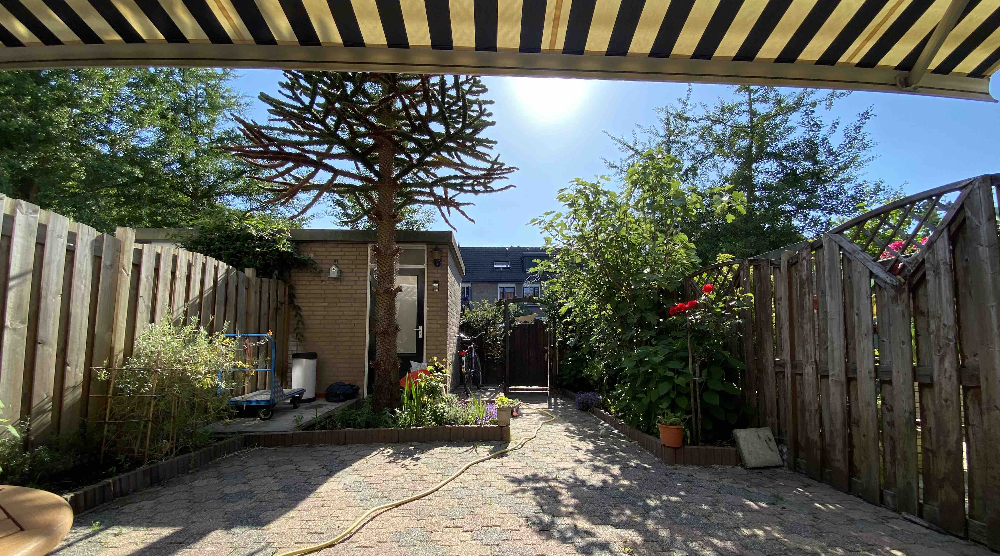

```{r load_packages, message=FALSE, warning=FALSE, include=FALSE} 
library(fontawesome)
```




We've put together a list of things you can do when you visit us.

</br>

[Biking in the Netherlands](https://www.jeremylabrecque.org/visit/biking)     
[Things to see in Rotterdam](https://www.jeremylabrecque.org/visit/things_to_see_Rotterdam)      
[Museums](https://www.jeremylabrecque.org/visit/museums)        
[Food](https://www.jeremylabrecque.org/visit/food)         
[Beer](https://www.jeremylabrecque.org/visit/beer)      
