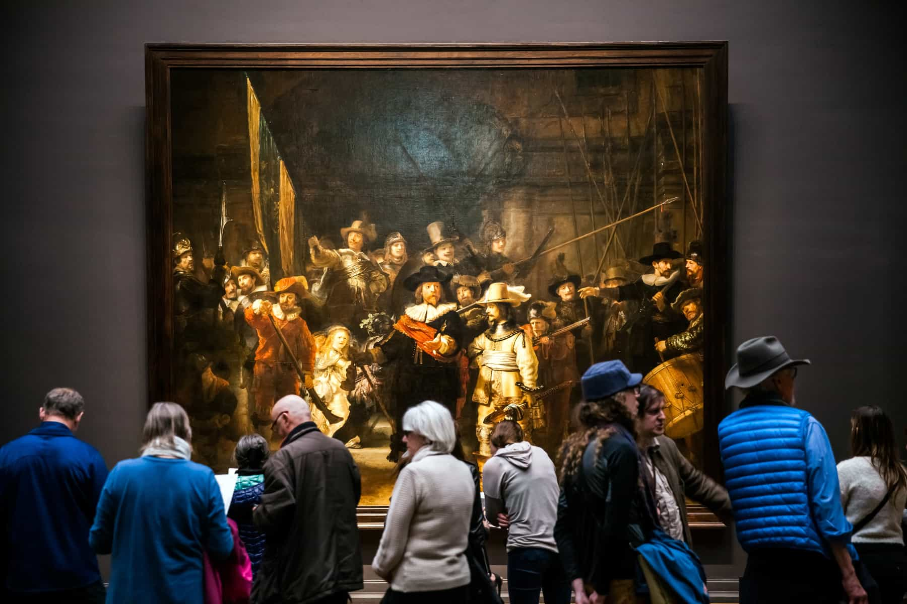
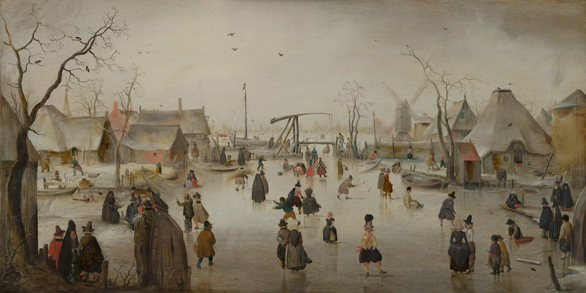

```{r load_packages, message=FALSE, warning=FALSE, include=FALSE} 
library(fontawesome)
```


### Rijksmuseum (Amsterdam)
`r fa("bus-alt", fill = "steelblue")` [1hr 40min](https://goo.gl/maps/XjQjdMQHdRPKTnGZA)      
`r fa("car-side", fill = "steelblue")` [1hr 8min](https://goo.gl/maps/dxvUht9Cf29zR1Lw8)     
[Link](https://www.rijksmuseum.nl/nl)

[](https://lonelyplanetwpnews.imgix.net/2018/10/The-Night-Watch-SS-Alexander-Tolstykh-1.jpg)

The most famous museum in the Netherlands. Home of many paintings you will actually recognize most notably by Rembrandt and Vermeer. But there's an antigue gun collection and armor and you could spend days here. 


### Mauritshuis (The Hague)
`r fa("bus-alt", fill = "steelblue")` [1hr 16min](https://goo.gl/maps/j1EDCHMuixoxp25y7)      
`r fa("car-side", fill = "steelblue")` [31min](https://goo.gl/maps/9QKDk6BfsGBXBVjt6)    
[Link](https://www.mauritshuis.nl/en/)

[](https://www.mauritshuis.nl/media/zyxlp4ne/0785_repro.jpg?center=0.60572336177729136,0.52808112324492984&mode=crop&width=3840&rnd=132760174832670000&quality=70)

