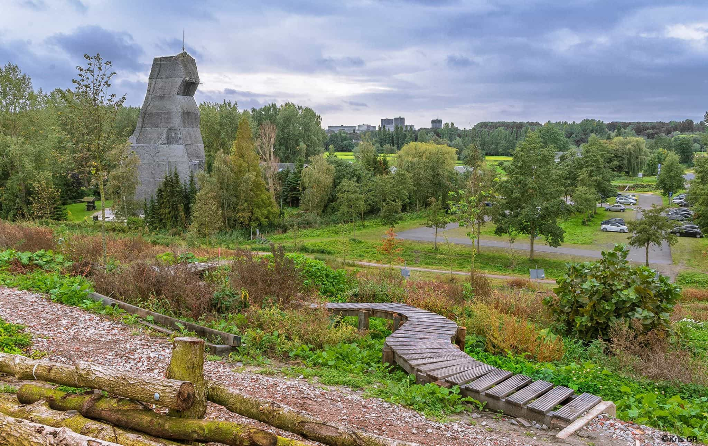

```{r load_packages, message=FALSE, warning=FALSE, include=FALSE} 
library(fontawesome)
```

### Kinderdijk
`r fa("biking", fill = "steelblue")` [13.5km (52min)](https://goo.gl/maps/jaLZ4SNSwod7T5MS6)          
`r fa("bus-alt", fill = "steelblue")` [1hr 8min](https://goo.gl/maps/ARvnCN2Ep9wUirhf7)     
[Link](https://www.kinderdijk.com/)


A UNESCO World Heritage site, Kinderdijk is a collection of old windmills which were once used to pump water up into the Maas River in order to drain wetlands for agriculture.  


</br>
</br>

### The highest point in South Holland
`r fa("biking", fill = "steelblue")` [3.3km (10min)](https://goo.gl/maps/zuAqCKgH1gV1GQ4K8)      
`r fa("walking", fill = "steelblue")` [3.3km (40min)](https://goo.gl/maps/A5psZ6C6xQizaEL38) 


Okay, it's only 20m above sea level but you still get a nice view. You can see The Hague and Delft from the top as well as downtown Rotterdam. You can also get a good feel for how many greenhouses there are in the area. Definitely worth doing this once while visiting. 

### Outdoor Valley
`r fa("biking", fill = "steelblue")` [4.3km (13min)](https://goo.gl/maps/9QVDVy5jGfByVvKA6)      
`r fa("walking", fill = "steelblue")` [3.3km (40min)](https://goo.gl/maps/A5psZ6C6xQizaEL38) 
[Link](https://outdoorvalley.nl/)

[](https://outdoorvalley.nl/wp-content/uploads/2017/08/MTB-parcours.jpg)

A ton of activities here. You can rent canoes and paddle around. You can rock climb. You can play frisbee golf. Or you can just walk around. And you can fish, of course. You can fish anywhere. 


