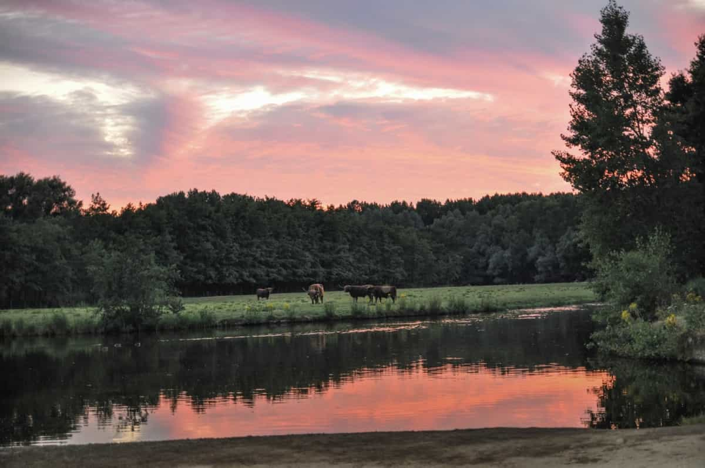

```{r load_packages, message=FALSE, warning=FALSE, include=FALSE} 
library(fontawesome)
```

### The Cube Houses
[Google Maps](https://goo.gl/maps/YKyFf1G1M7JrMozL9)      
`r fa("bus-alt", fill = "steelblue")` 31min   
`r fa("biking", fill = "steelblue")` 25min


A wonder of 1970's technology. I think I heard theywere long considered an eyesore but they were spruced up and now they're a major tourist attraction here in Rotterdam. You can kind of walk through them which is pretty cool. Leads you straight to the Old Port.


<br>
<br>


### Markthal
[Google Maps](https://goo.gl/maps/XEwiCxPag8AeSKxq6)
`r fa("bus-alt", fill = "steelblue")` 31min      
`r fa("biking", fill = "steelblue")` 25min     


Right next to the Cube Houses and the Old Port, it's a huge indoor market where you can get many types of food. A bit more upscale but worth seeing. We often bring people here to eat the raw herring!

<br>
<br>

### Oudehaven (The Old Port)
[Google Maps](https://goo.gl/maps/x7rLX41v2rdxg5RP8)      
`r fa("bus-alt", fill = "steelblue")` 31min   
`r fa("biking", fill = "steelblue")` 25min


One of the must see sites in Rotterdam. It's a small little port but cute and you can sit next to water with a beer or coffee. Witte Huis is a good place for a beer.

<br>
<br>

### Euromast
[Google Maps](https://goo.gl/maps/uF5ZDBYYSA8kUgPg6)     
`r fa("bus-alt", fill = "steelblue")` 46min      
`r fa("biking", fill = "steelblue")` 33min     
[Link](https://euromast.nl/)


It's kind of like the CN Tower of Rotterdam but not as tall. But you still get fantastic view of the whole city. Well worth doing while you're here.

<br>
<br>

### Kinderdijk
`r fa("biking", fill = "steelblue")` [13.5km (52min)](https://goo.gl/maps/jaLZ4SNSwod7T5MS6)          
`r fa("bus-alt", fill = "steelblue")` [1hr 8min](https://goo.gl/maps/ARvnCN2Ep9wUirhf7)     
[Link](https://www.kinderdijk.com/)


A UNESCO World Heritage site, Kinderdijk is a collection of old windmills which were once used to pump water up into the Maas River in order to drain wetlands for agriculture.  


</br>
</br>

### The highest point in South Holland
`r fa("biking", fill = "steelblue")` [3.3km (10min)](https://goo.gl/maps/zuAqCKgH1gV1GQ4K8)      
`r fa("walking", fill = "steelblue")` [3.3km (40min)](https://goo.gl/maps/A5psZ6C6xQizaEL38) 


Okay, it's only 20m above sea level but you still get a nice view. You can see The Hague and Delft from the top as well as downtown Rotterdam. You can also get a good feel for how many greenhouses there are in the area. Definitely worth doing this once while visiting. 

<br>
<br>

### Outdoor Valley/Hoge Bergse Bos
`r fa("biking", fill = "steelblue")` [4.3km (13min)](https://goo.gl/maps/9QVDVy5jGfByVvKA6)      
`r fa("walking", fill = "steelblue")` [3.3km (40min)](https://goo.gl/maps/A5psZ6C6xQizaEL38) 
[Link](https://outdoorvalley.nl/)

[](https://outdoorvalley.nl/wp-content/uploads/2017/08/MTB-parcours.jpg)

A ton of activities here. You can rent canoes and paddle around. You can rock climb. You can play frisbee golf. Or you can just walk around. And you can fish, of course. You can fish anywhere. 

<br>
<br>

### Lage Bergse Bos

[Google Maps](https://goo.gl/maps/bpMkrszq4hu15qHb7)       
`r fa("biking", fill = "steelblue")` 7min         
`r fa("walking", fill = "steelblue")` 23min   

[](https://www.boswachtersblog.nl/zuid-holland/wp-content/uploads/sites/17/2019/02/12975-Zonsondergang-Lage-Bergse-Bos.jpg)

A nice park close by where you can run into cattle in the middle of the woods. There are two restaurants in the middle of the woods. Familierestaurant Bergsche Plas is good for Dutch pancakes and has a nice view over a small lake. Actually both places in the park have nice views over a small lake. There's also a horseback writing center in the north of the park. 


